# 🏛️ Multilingual Visual Question Answering for Cultural Heritage Sites of Bangladesh

> A fine-tuned **BLIP VQA** system supporting **English & Bangla** language queries on cultural heritage images, enhanced with **Groq LLaMA 3.3 70B** for natural language refinement — deployed as a **Streamlit** web application.

---

## 📌 Project Overview

This capstone project presents a **Multilingual Visual Question Answering (VQA)** system built specifically for the cultural heritage sites of Bangladesh. Users upload an image of a heritage site and ask questions in **English or Bangla**. The system processes them through a fine-tuned **BLIP VQA model**, generates a raw answer, and refines it using the **Groq LLaMA 3.3 70B** LLM. Language detection via **Google Translator** ensures the final answer is returned in the same language as the question.

```
Input: Image + Question (English or Bangla)
              ↓
   BLIP Processor → Tensor Format
              ↓
   Fine-tuned BLIP VQA Model (best_vqa_models_NLP.pth)
              ↓
          Raw Answer
              ↓
   Groq API → LLaMA 3.3 70B (Answer Enhancement)
              ↓
   Google Translator (if question was in Bangla)
              ↓
Output: Natural Language Answer (English or Bangla)
```

---

## 🗂️ Repository Structure

```
BLIPFinalAPP/
│
├── CapstoneUP/                          # Project assets & resources
├── CpstUP/                              # Additional project files
│
├── finalblipmodeleng.ipynb              # Kaggle training notebook (BLIP fine-tuning)
│
├── VQA_Fine_Tune.py                     # VQA model fine-tuning script
├── app.py                               # Streamlit web application (main app)
├── capstoneUpdate.py                    # Final updated Streamlit application
├── requirements.txt                     # Python dependencies
│
├── A Multilingual Visual Question
│   Answering for C...                   # Capstone project report (PDF)
│
└── README.md
```

> ⚠️ **Note:** The trained model file `best_vqa_models_NLP.pth` (~1.5GB) is **not included** in this repository due to GitHub's file size limit. You must train it using `finalblipmodeleng.ipynb` on Kaggle or download it separately.

---

## 📦 Dataset

A custom dataset was built from scratch covering major **cultural heritage sites of Bangladesh**, including Lalbagh Fort, Ahsan Manzil, Shat Gombuj Mosque, Somapura Mahavihara (Paharpur), and others. Each entry contains a heritage site image, a question in English or Bangla, and a ground truth answer.

### 📸 Dataset Samples

<p align="center">
  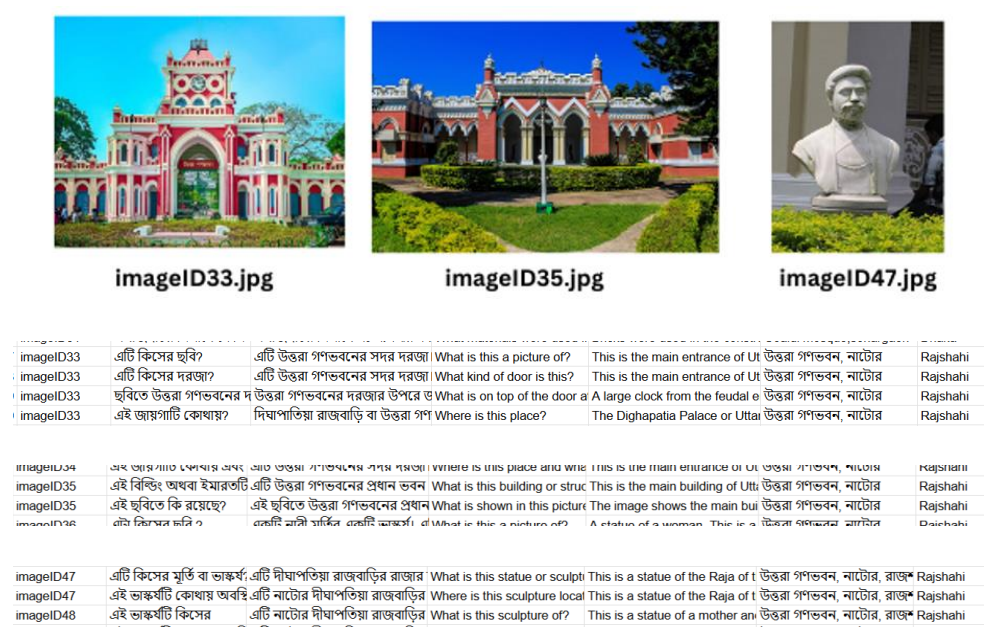
</p>

---

## 🏋️ Model Training

The base **`Salesforce/blip-vqa-base`** model was fine-tuned on the custom heritage dataset using **Kaggle GPU (P100)**.

### Training Notebook
📓 [`finalblipmodeleng.ipynb`](./finalblipmodeleng.ipynb)

### Hyperparameters

| Parameter | Value |
|---|---|
| Base Model | `Salesforce/blip-vqa-base` |
| Loss Function | Cross-Entropy Loss |
| Optimizer | AdamW |
| Learning Rate | `5e-5` (cosine scheduler) |
| Batch Size | 4 |
| Epochs | 50 |
| Workers | 3 |
| Image Size | 384 × 384 px |
| Device | Kaggle GPU — P100 |
| Output File | `best_vqa_models_NLP.pth` |

### Data Augmentation

**Text Augmentation:**

| Technique | Description |
|---|---|
| Synonym Replacement | Replaces 30% of words with synonyms |
| Random Word Swap | Swaps words randomly at 20% probability |
| Random Word Deletion | Deletes words at 20% probability |

**Image Augmentation:**

| Technique | Description |
|---|---|
| Resizing | Standardizes images to 384×384 px |
| Color Jitter | Adjusts brightness, contrast, saturation & hue |
| Random Rotation | Rotates within ±10 degree range |
| Horizontal Flip | Mirrors images at 50% probability |

### Evaluation Metrics

| Metric | Description |
|---|---|
| Accuracy | % of correct answers generated |
| Precision | Relevant predictions among all generated answers |
| Recall | Correct answers successfully retrieved |
| F1-Score | Harmonic mean of Precision and Recall |

---

## 🧠 Model Architecture — BLIP

**BLIP (Bootstrapped Language-Image Pre-training)** follows a transformer-based encoder-decoder architecture:

| Component | Role |
|---|---|
| Vision Encoder (ViT) | Extracts visual features from the image |
| Text Encoder | Converts the input question into model-readable format |
| Cross-Attention Mechanism | Links visual features with question tokens |
| Decoder | Generates the final answer from combined context |
| Tokenizer | Breaks text into processable tokens |

---

## 🛠️ Tech Stack

| Layer | Technology |
|---|---|
| Web Application | Streamlit |
| VQA Model | Salesforce BLIP (fine-tuned) |
| LLM Enhancement | Groq API — LLaMA 3.3 70B Versatile |
| Language Detection & Translation | Google Translator |
| Image Processing | Pillow |
| Deep Learning | PyTorch + HuggingFace Transformers |

---

## ⚙️ System Workflow

```
User
 │
 │  Uploads Image + Types Question
 ▼
Streamlit Interface (app.py / capstoneUpdate.py)
 │
 ├── Language Detection (Google Translator)
 │     English? → proceed
 │     Bangla?  → translate to English for model input
 │
 ├── BLIP Processor → converts to Tensor
 │
 ▼
Fine-tuned BLIP VQA Model
 │
 │  Raw Answer (English)
 ▼
Groq API → LLaMA 3.3 70B
 │
 │  Enhanced Natural Language Answer
 ▼
Google Translator
 │  (if original question was Bangla → translate answer to Bangla)
 ▼
Display Answer on Streamlit UI
```

---

## 🌐 Multilingual Support

| Question Language | Answer Language |
|---|---|
| English | English |
| Bangla (বাংলা) | Bangla (বাংলা) |

Language detection is fully automatic. The model always processes internally in English; if the question was in Bangla, the final enhanced answer is translated back to Bangla before display.

---

### 📸 Primary System Architechture

<p align="center">
  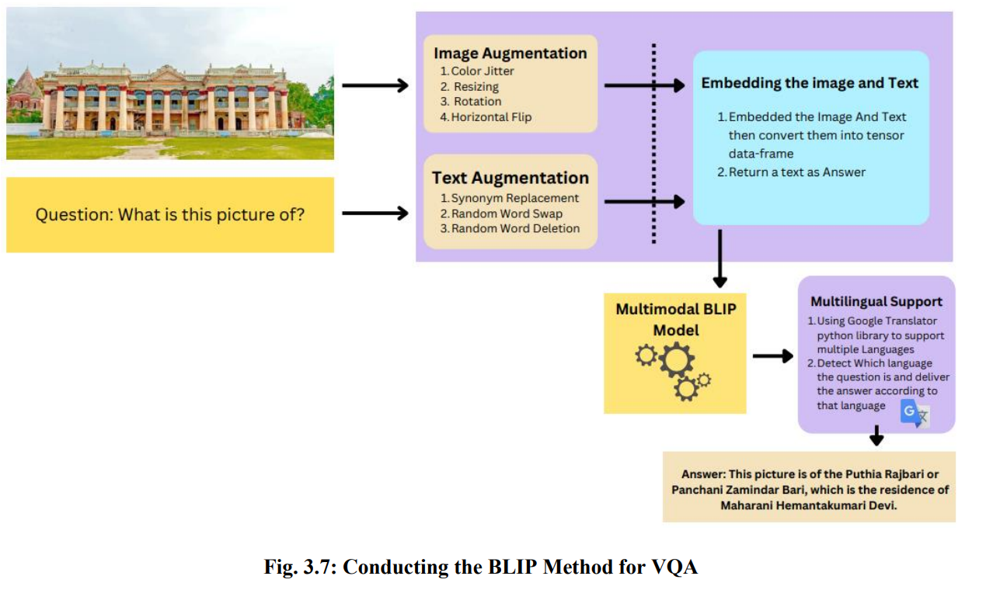
</p>

---

## 🖥️ Application Interface

### Main Interface


<p align="center">
  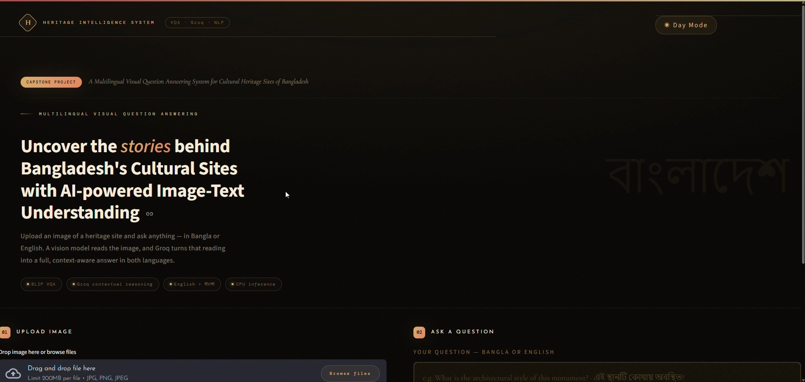
</p>

<p align="center">
  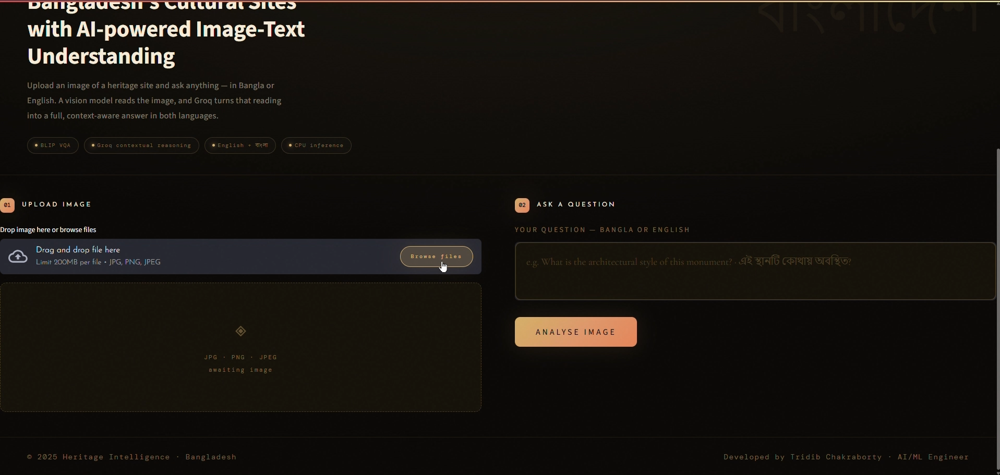
</p>

<p align="center">
  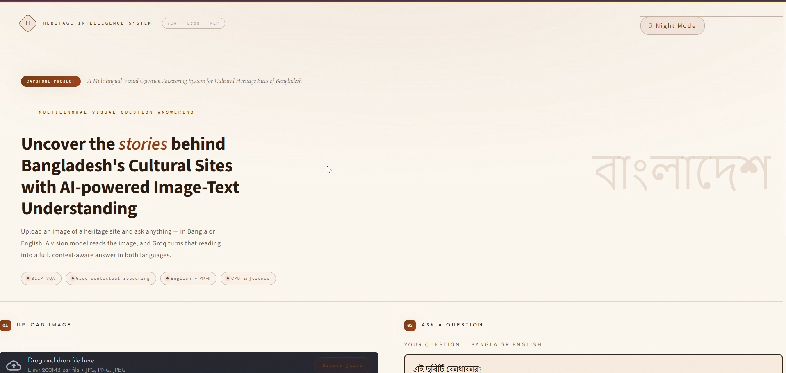
</p>

<p align="center">
  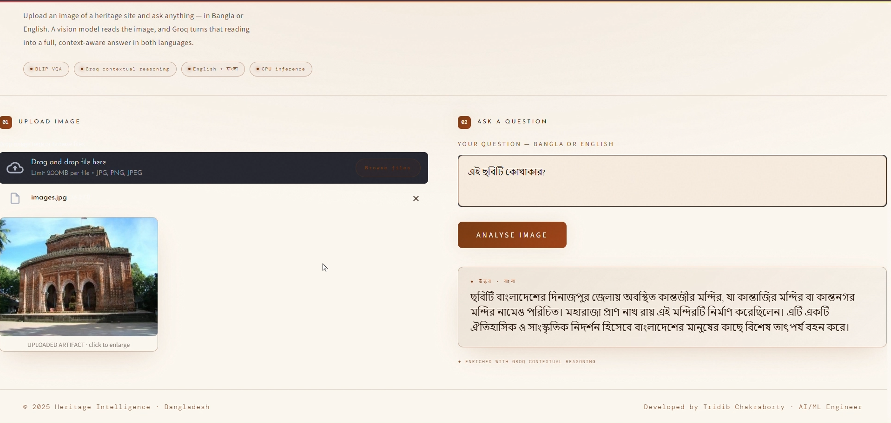
</p>

---


### Result Output


<p align="center">
  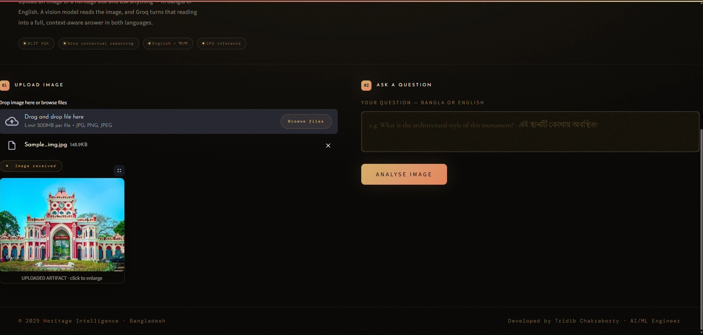
</p>

<p align="center">
  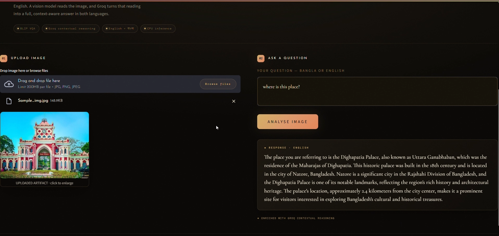
</p>

<p align="center">
  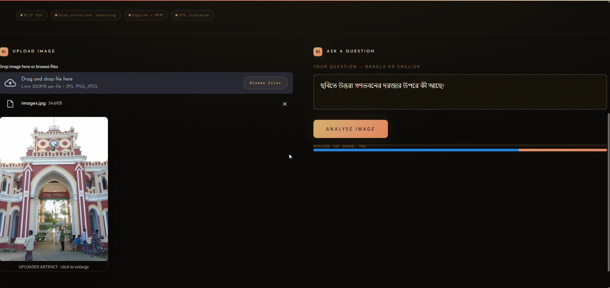
</p>

<p align="center">
  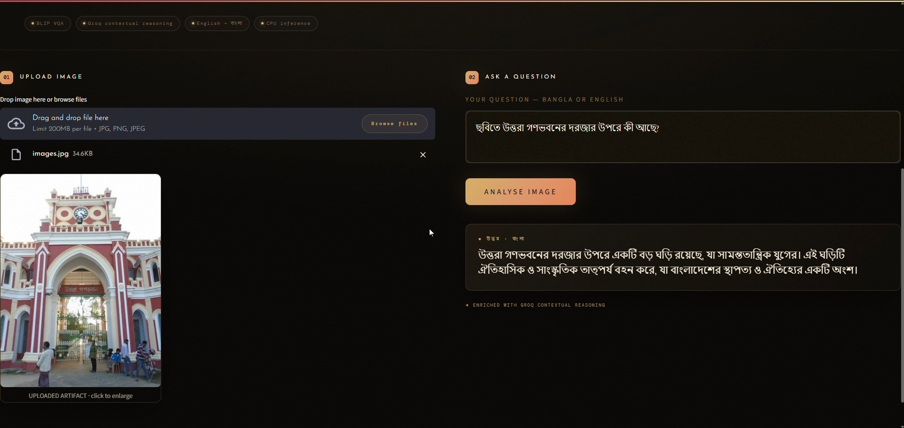
</p>

<p align="center">
  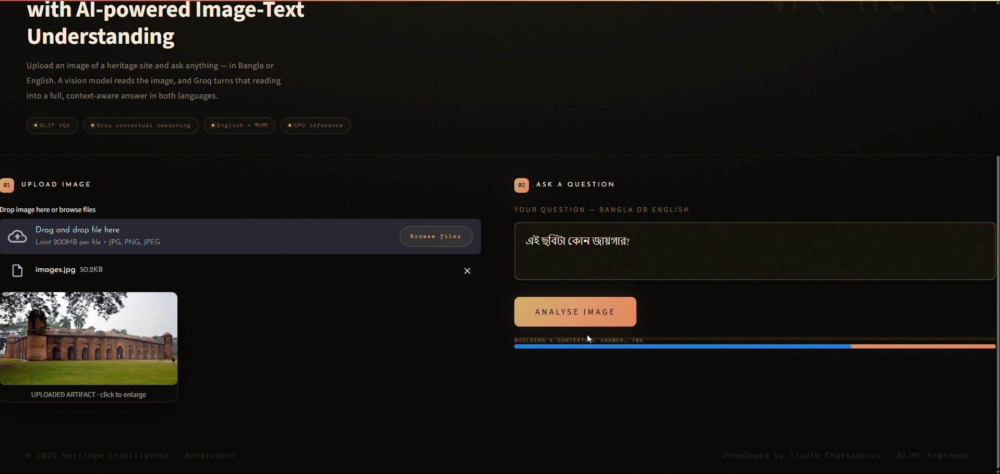
</p>


<p align="center">
  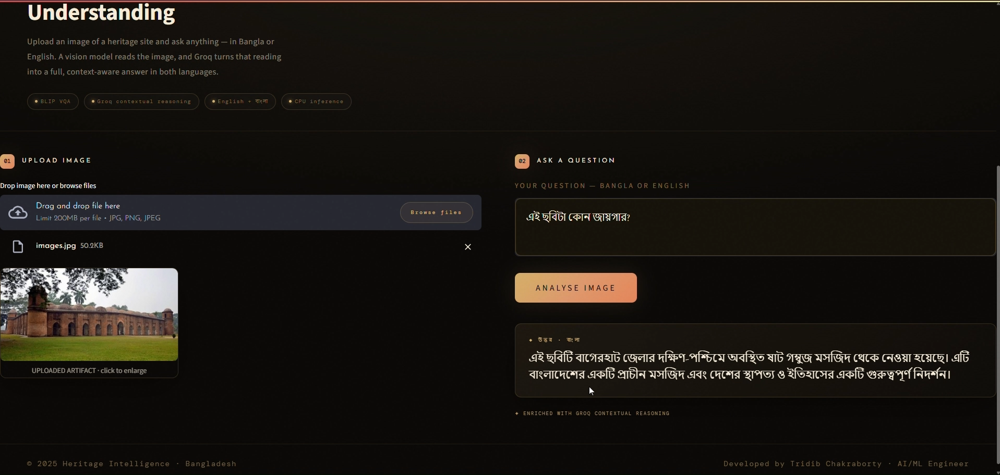
</p>

---

## 🚀 Local Setup

### Prerequisites
- Python 3.10+
- Groq API Key → [console.groq.com](https://console.groq.com)
- `best_vqa_models_NLP.pth` (trained model file — train via Kaggle notebook)

### Installation

```bash
git clone https://github.com/imtridib/YOUR_REPO_NAME.git
cd BLIPFinalAPP
pip install -r requirements.txt
```

### Run the App

```bash
# Main application
streamlit run app.py

# or updated version
streamlit run capstoneUpdate.py
```

### Environment Setup

Create a `.streamlit/secrets.toml` file:

```toml
GROQ_API_KEY = "your_groq_api_key_here"
```

---

## 📋 Dependencies

Key packages from `requirements.txt`:

```
streamlit
torch
torchvision
transformers
Pillow
groq
googletrans==4.0.0rc1
```

---

## 👤 Author

**Tridib Chakraborty**
AI Engineer | Capstone Project 2025
East West University, Bangladesh

GitHub: [@imtridib](https://github.com/imtridib)

---

## 📄 License

Developed as an academic capstone project.
© 2025 Tridib Chakraborty. All rights reserved.
